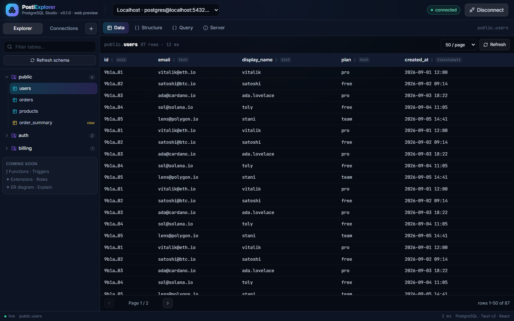
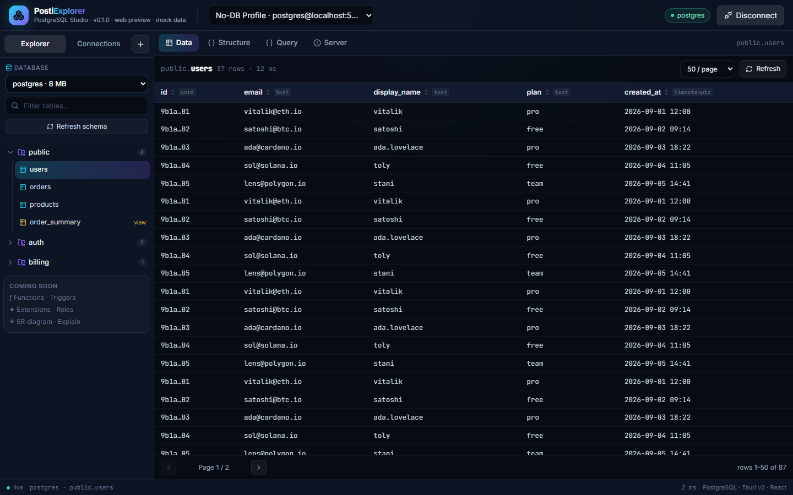
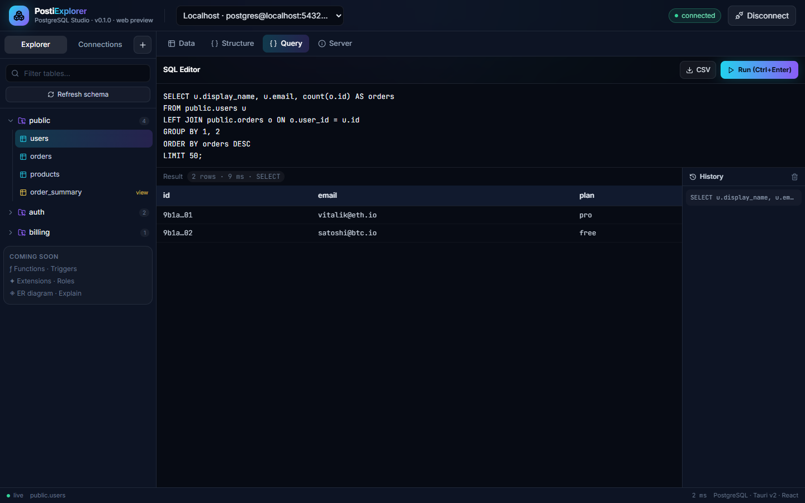

<div align="center">
  
  <h1>PostiExplorer</h1>
  <p>Modern single-binary PostgreSQL explorer — Tauri v2 (Rust) + React + TypeScript + Tailwind.</p>
  <p>
    <a href="https://github.com/JohnGrubba/postiexplorer/actions/workflows/build.yml"></a>
    <a href="https://github.com/JohnGrubba/postiexplorer/blob/main/LICENSE"></a>
    
    
  </p>
</div>

## Download

Direct downloads from the rolling
[`latest` release](https://github.com/JohnGrubba/postiexplorer/releases/latest)
(rebuilt by [CI](.github/workflows/build.yml) on every push to `main`):

| OS | Recommended | Alternative |
| -- | ----------- | ----------- |
| Windows x64 | [Installer (`PostiExplorer_x64-setup.exe`)](https://github.com/JohnGrubba/postiexplorer/releases/latest/download/PostiExplorer_x64-setup.exe) | [Portable `postiexplorer.exe`](https://github.com/JohnGrubba/postiexplorer/releases/latest/download/postiexplorer.exe) |
| Windows ARM64 | [Installer (`PostiExplorer_arm64-setup.exe`)](https://github.com/JohnGrubba/postiexplorer/releases/latest/download/PostiExplorer_arm64-setup.exe) | — |
| Linux (x64) | [AppImage (`PostiExplorer_amd64.AppImage`)](https://github.com/JohnGrubba/postiexplorer/releases/latest/download/PostiExplorer_amd64.AppImage) — `chmod +x` to run | [`.deb` (`PostiExplorer_amd64.deb`)](https://github.com/JohnGrubba/postiexplorer/releases/latest/download/PostiExplorer_amd64.deb) |
| macOS (Apple Silicon) | [`PostiExplorer_aarch64.dmg`](https://github.com/JohnGrubba/postiexplorer/releases/latest/download/PostiExplorer_aarch64.dmg) | — |

See the [full file list](https://github.com/JohnGrubba/postiexplorer/releases/latest)
for everything else. File names carry no version on purpose, so these links
stay valid across releases — the running app's version is shown in its
header and status bar. Or build locally — see [BUILD.md](BUILD.md).

## Screenshots





More verified UI states in [`screenshots/`](screenshots/).

## Features

### ✅ Implemented

| Area | What you get |
| ---- | ------------ |
| **Connections** | Profiles (host, port, user, **optional database**, sslmode) with test-connection and latency; detailed errors with SQLSTATE codes (no bare `db error`) |
| **Database picker** | Leave the database empty to land on the `postgres` maintenance DB, then switch databases from the sidebar without reconnecting manually |
| **Explorer** | Schemas / tables / views / matviews / foreign tables with search, row estimates, sizes, and refresh |
| **Data** | Paginated grid (25–250/page, server-side LIMIT/OFFSET), click-to-sort, totals + timing; insert / edit / delete rows via `RowEditorDialog` (ctid-addressed, works even without PKs; views are read-only) |
| **Structure** | Columns, types, nullable, defaults, PK badges |
| **ER Model** | Interactive diagram of all tables + FK edges: pan/zoom, drag-to-arrange, 3 auto-layouts (Grid / By schema / Hub & spokes), search + schema filter, click-to-isolate, SVG + Mermaid export |
| **ER detail toggles** | Column types · nullability dots · defaults · row counts · views · isolated tables · relation labels · schema colours (persisted to localStorage) |
| **Query** | SQL editor (Ctrl+Enter), results grid, 20-entry history, CSV export, timing + row counts |
| **Server** | Version, database size, table count, connections, uptime cards |

### ❌ Not yet implemented (roadmap)

| Area | Status |
| ---- | ------ |
| Functions / procedures explorer | Planned |
| Triggers explorer | Planned |
| Extensions manager | Planned |
| Roles / users manager | Planned |
| EXPLAIN ANALYZE visualizer | Planned |
| Multi-statement batches in editor | Planned |
| Import / export (CSV, dump) | CSV export of query results done; full import/export planned |
| TLS (`sslmode=require`) | Accepted + validated, still connects via `NoTls` — see `TLS TODO` in `src-tauri/src/db.rs` |

Extension points for these already exist (`FutureModule` in `src/types.ts`;
modular command layer in `src-tauri/src/db.rs`).

## Architecture

All PostgreSQL access lives in `src-tauri/src/db.rs`. Every Tauri command in
`src-tauri/src/main.rs` is a thin wrapper — a new feature only needs:

1. a new function in `db.rs`,
2. a new `#[tauri::command]` in `main.rs`,
3. a frontend call in `src/lib/api.ts` (+ mock in `src/lib/mock.ts` for web preview).

## Quick start (development)

```bash
npm install
npm run dev        # web preview with mock data (no database needed)
```

Open http://127.0.0.1:1420 — click **Connect** to browse mock data.
The header shows `web preview · mock data` in this mode.

For a live database, run the desktop window:

```bash
docker compose up -d   # local postgres:16, seeds demo_db from seed.sql
npm run tauri dev      # header shows "desktop · live backend"
```

## Project layout

```
src/                  React frontend
  components/         Header, Sidebar, DataGrid, TableDataView, RowEditorDialog,
                      StructureView, ErDiagramView, QueryView, InfoView,
                      ConnectionDialog, StatusBar
  lib/api.ts          Tauri invoke wrapper + browser mock fallback
  lib/mock.ts         Demo dataset (used when Tauri IPC is absent)
  lib/profiles.ts     localStorage persistence
  types.ts            Shared TS types (mirror of Rust models.rs)
src-tauri/
  src/lib.rs          Library root (re-exports db + models for tests)
  src/main.rs         Tauri commands (thin wrappers)
  src/db.rs           All SQL + connection pool (Arc<Mutex<Client>>)
  src/models.rs       Serde structs
  tests/live_db.rs    Integration tests vs real PostgreSQL
  tauri.conf.json     Window + bundle config
  capabilities/       Permissions
scripts/              build-release.mjs (collects bundles into ./releases/)
screenshots/          Verified UI states
```

## Testing

```bash
npx tsc --noEmit
npm run build
cargo test --test live_db --manifest-path src-tauri/Cargo.toml   # needs docker compose up -d
```

`src-tauri/tests/live_db.rs` covers connect, empty-database picker flow,
wrong-password / wrong-database errors, databases → schemas → tables →
columns → paged/sorted rows → raw SQL → server info. CI runs the same suite
on every push (Linux job).

## Contributing

See [CONTRIBUTING.md](CONTRIBUTING.md). Bug reports and small, well-scoped PRs
welcome — please include the header subtitle, exact error text, and (for UI)
a screenshot. By participating you agree to the
[Code of Conduct](CODE_OF_CONDUCT.md).

## Security

See [SECURITY.md](SECURITY.md) for supported versions and how to report
vulnerabilities privately.

## License

[MIT](LICENSE) © 2026 Jonas Grubbauer. Built with
[Tauri](https://tauri.app), [tokio-postgres](https://github.com/sfackler/rust-postgres),
React and Tailwind CSS.
