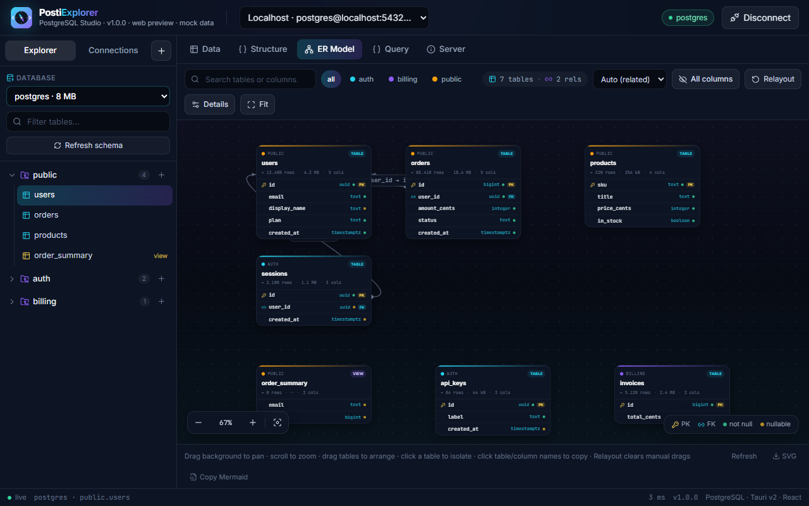
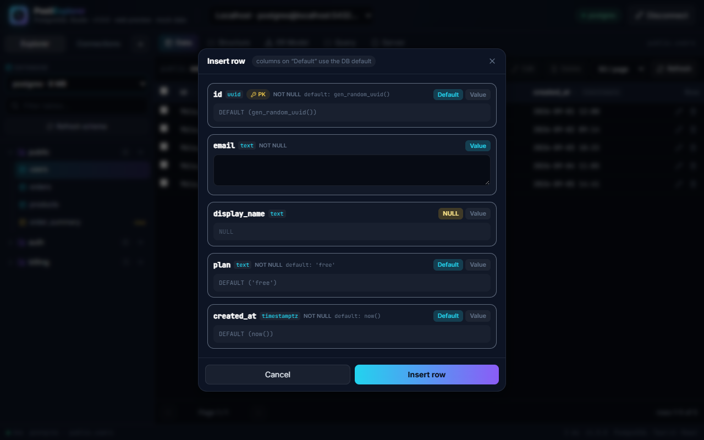
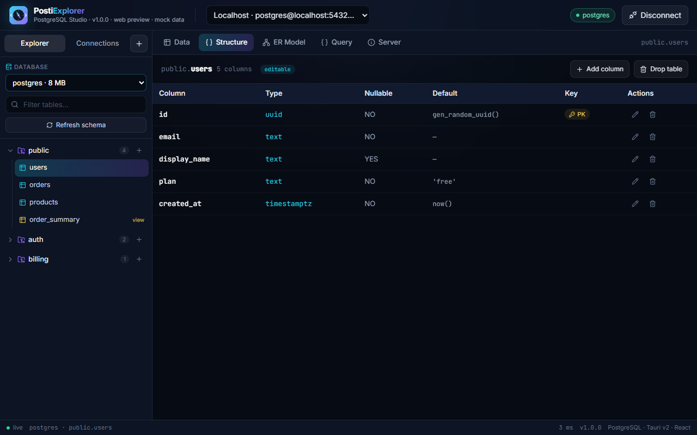

<div align="center">
  
  <h1>PostiExplorer</h1>
  <p>Modern single-binary PostgreSQL explorer — Tauri v2 (Rust) + React + TypeScript + Tailwind.</p>
  <p>
    <a href="https://github.com/JohnGrubba/postiexplorer/actions/workflows/build.yml"></a>
    <a href="https://github.com/JohnGrubba/postiexplorer/blob/main/LICENSE"></a>
    
    
  </p>
</div>

## Download

Direct downloads from the rolling
[`latest` release](https://github.com/JohnGrubba/postiexplorer/releases/latest)
(rebuilt by [CI](.github/workflows/build.yml) on every push to `main`):

| OS | Recommended | Alternative |
| -- | ----------- | ----------- |
| Windows x64 | [Installer (`PostiExplorer_x64-setup.exe`)](https://github.com/JohnGrubba/postiexplorer/releases/latest/download/PostiExplorer_x64-setup.exe) | [Portable `postiexplorer.exe`](https://github.com/JohnGrubba/postiexplorer/releases/latest/download/postiexplorer.exe) |
| Windows ARM64 | [Installer (`PostiExplorer_arm64-setup.exe`)](https://github.com/JohnGrubba/postiexplorer/releases/latest/download/PostiExplorer_arm64-setup.exe) | — (installer-only; `SKIP_PORTABLE=1` avoids a `postiexplorer.exe` name collision with x64) |
| Linux (x64) | [AppImage (`PostiExplorer_amd64.AppImage`)](https://github.com/JohnGrubba/postiexplorer/releases/latest/download/PostiExplorer_amd64.AppImage) — `chmod +x` to run | [`.deb` (`PostiExplorer_amd64.deb`)](https://github.com/JohnGrubba/postiexplorer/releases/latest/download/PostiExplorer_amd64.deb) |
| macOS (Apple Silicon) | [`PostiExplorer_aarch64.dmg`](https://github.com/JohnGrubba/postiexplorer/releases/latest/download/PostiExplorer_aarch64.dmg) | — |

See the [full file list](https://github.com/JohnGrubba/postiexplorer/releases/latest)
for everything else (`.msi`, `.rpm`, `.app.tar.gz`). File names carry no
version on purpose (`scripts/artifact-names.mjs` strips it at collect time;
`KEEP_VERSIONED_NAMES=1` keeps Tauri's originals), so these links stay valid
across releases — the running app's version (single source: `package.json`,
baked in as `__APP_VERSION__`) is shown in its header and status bar.
Or build locally — see [BUILD.md](BUILD.md).

## Screenshots







## Features

### ✅ Implemented

| Area | What you get |
| ---- | ------------ |
| **Connections** | Profiles (host, port, user, **optional database**, sslmode) persisted to `localStorage` (`src/lib/profiles.ts`), managed in the sidebar's Connections tab; demo `Localhost` profile seeded on first run; test-connection with latency + server version; detailed errors with SQLSTATE codes (e.g. `28P01`, `3D000`), never bare `db error` |
| **Database picker** | Leave the database empty to land on the `postgres` maintenance DB (`effectiveProfile` in `api.ts` + `conn_string` in `db.rs`), then switch databases from the sidebar without reconnecting manually (old connection id is closed, tree is refreshed); databases without `CONNECT` are shown disabled with `(no CONNECT)` |
| **Explorer** | Schemas / tables / views / matviews / foreign tables with table filter, row estimates, sizes, and refresh; per-schema `+` button opens a create-table dialog (gated by `can_create`); lock icons + disabled rows for missing `USAGE` / `SELECT`; per-schema failure never wipes the whole tree |
| **Data** | Paginated grid (25 / 50 / 100 / 250 per page, server-side `LIMIT`/`OFFSET`), 3-state click-to-sort, totals + timing; checkbox multi-select with bulk delete (server cap: max 1000 ctids); insert / edit / delete via `RowEditorDialog` with `NULL` / `DEFAULT` / `Value` modes per column, JSON validation and bool dropdowns (ctid-addressed, works even without PKs; views/matviews are read-only with a badge); stale ctid after `UPDATE` fails with "row no longer exists — please refresh" (expected); empty tables report columns so Add works; buttons gated up-front by `can_insert` / `can_update` / `can_delete` (`limited privileges` pill) |
| **Structure (DDL)** | Columns, types, nullable, defaults, PK badges **plus full editing**: create table (sidebar dialog, single-column PK inlined / composite PK as table constraint), add column, rename column, alter type (`USING col::type`), set/drop `NOT NULL`, set/drop `DEFAULT`, drop column, drop table — all privilege-gated (`can_alter` / `can_drop`, views read-only); identifiers always double-quoted via `quote_ident`; type/default expressions validated (no `;`, NUL, comments or quotes in types; no statement chaining in defaults; 63-char table / 100-column limits) |
| **Privileges** | `get_table_privileges` / `get_schema_privileges` (owner via role membership, superuser flag, `SELECT`/`INSERT`/`UPDATE`/`DELETE`/`TRUNCATE`/`REFERENCES`/`TRIGGER`, `can_alter`/`can_drop`, `USAGE`/`CREATE`) surface as `editable` badges in Structure, `read-only` / `limited privileges` pills in Data, and disabled sidebar / dialog buttons — writes still fail server-side for bypass attempts (covered by a dedicated readonly-role live test) |
| **ER Model** | Interactive diagram of all user tables + FK edges on a GPU-composited canvas edge layer (devicePixelRatio-crisp, geometric hit-testing): pan/zoom (25–220%), drag-to-arrange, fit-to-view, 4 auto-layouts (Auto `related` / Grid / By schema / Hub & spokes) with relayout, search across tables **and** columns, schema filter chips, click-to-isolate with dimming, click-to-copy table/column names, `+N more — show all` in compact mode, viewport culling + memoized nodes for large diagrams, SVG export + Mermaid copy (native save dialog on desktop) |
| **ER detail toggles** | 9 toggles persisted to `localStorage`: relations-only (keys-only compact mode) · column types · nullability dots · defaults · row counts · views · isolated tables · relation labels (auto-throttled past 150 edges, hidden below 0.45× zoom) · schema colours |
| **Query** | SQL editor (Ctrl/Cmd+Enter), results grid with type badges, per-profile+database persisted SQL/history/result (`localStorage`, debounced, result capped at 200 rows); 20-entry deduped history with clear + click-to-rerun; selection-following starter `SELECT * … LIMIT 100` until first edit/run; timing + row count + command + `rows affected` notice for writes; CSV export with BOM for Excel (native Save dialog via `@tauri-apps/plugin-dialog` + `plugin-fs` on desktop, anchor download in browser) |
| **Server** | Version, database size, table count, connections (`n / max`), uptime cards; notes that extensions / roles / vacuum / replication / locks panels are stubbed for the next milestone |
| **Web preview vs desktop** | `isTauri()` checks **both** `__TAURI__` and `__TAURI_INTERNALS__`; browser (`npm run dev`) uses `src/lib/mock.ts` demo dataset (`demo_db` / `analytics` / `postgres`; `public` / `auth` / `billing`; incl. `order_summary` view), header shows `web preview · mock data`; desktop (`npm run tauri dev`) calls the Rust backend, header shows `desktop · live backend` |

### ❌ Not yet implemented (roadmap)

| Area | Status |
| ---- | ------ |
| Functions / procedures explorer | Planned |
| Triggers explorer | Planned |
| Extensions manager | Planned |
| Roles / users manager | Planned |
| EXPLAIN ANALYZE visualizer | Planned |
| Multi-statement batches in editor | Planned (`execute_sql` prepares a single statement) |
| Import / export (CSV, dump) | CSV export of query results done (with BOM + native dialog); full import/dump planned |
| TLS (`sslmode=require`) | Accepted + validated, still connects via `NoTls` — see `TLS TODO` in `src-tauri/src/db.rs` |

Extension points for these already exist (`FutureModule` in `src/types.ts`;
modular command layer in `src-tauri/src/db.rs` — 24 thin `#[tauri::command]`
wrappers in `src-tauri/src/main.rs` over `db.rs` operations).

## Architecture

All PostgreSQL access lives in `src-tauri/src/db.rs` (`DbState` holds live
`tokio_postgres::Client`s as `Arc<tokio::sync::Mutex<Client>>` keyed by UUID).
Every Tauri command in `src-tauri/src/main.rs` is a thin wrapper — a new
feature only needs:

1. a new function in `db.rs` (`op_*`),
2. a new `#[tauri::command]` in `main.rs` (+ registration in `generate_handler!`),
3. a frontend call in `src/lib/api.ts` (+ mock in `src/lib/mock.ts` for web preview),
4. shared types in `src/types.ts` mirroring `src-tauri/src/models.rs`.

Backend details: `pg_err` renders severity + SQLSTATE + message + detail/hint;
`cell_to_json` maps `bool/int/float/numeric/text/uuid/json/bytea/date/time/ts`
to JSON; rows are ctid-addressed (`ctid::text AS "__postiexplorer_ctid"`,
strict `(block,offset)` validation); `quote_ident` + `quote_literal` /
`json_to_literal` keep DDL/DML injection-safe; empty `profile.database`
connects to the `postgres` maintenance DB.

Frontend details: `src/lib/api.ts` (`isTauri` dual-check, `effectiveProfile`,
`connectionId` handle, identical signatures for Tauri/mock) ·
`src/lib/profiles.ts` (`localStorage`) · `src/lib/download.ts` (Tauri native
save vs anchor fallback, BOM CSV builder). Layout is `h-screen` flex with
internal scroll (1280×800 window, 960px min width — no horizontal overflow).

## Quick start (development)

```bash
npm install
npm run dev        # web preview with mock data (no database needed)
```

Open http://127.0.0.1:1420 — click **Connect** to browse mock data.
The header shows `web preview · mock data` in this mode.

For a live database, run the desktop window:

```bash
docker compose up -d   # local postgres:16, seeds demo_db from seed.sql
npm run tauri dev      # header shows "desktop · live backend"
```

`docker-compose.yml` mounts `./seed.sql` into
`/docker-entrypoint-initdb.d/` (applied only on first start — `pgdata`
persists). Reseed with `docker compose down -v && docker compose up -d`.
Seed creates `demo_db` with `public.users` / `orders` / `products`, view
`public.order_summary`, plus `auth.sessions` and `billing.invoices`.

## Project layout

```
src/                  React frontend
  App.tsx             Profiles, connect/switch/disconnect, schema/table/tab state,
                      per-profile+db query persist key
  assets/logo.svg     App logo (header)
  components/         Header, Sidebar (+ CreateTableDialog), DataGrid,
                      TableDataView, RowEditorDialog, StructureView (+ ColumnDialog),
                      ErDiagramView, QueryView, InfoView, ConnectionDialog, StatusBar
  lib/api.ts          Tauri invoke wrapper + browser mock fallback (isTauri,
                      effectiveProfile, connectionId)
  lib/mock.ts         Demo dataset (used when Tauri IPC is absent)
  lib/profiles.ts     localStorage persistence for connection profiles
  lib/download.ts     Native save-dialog vs anchor download + BOM CSV builder
  types.ts            Shared TS types (mirror of Rust models.rs + FutureModule stub)
src-tauri/
  src/lib.rs          Library root (re-exports db + models for tests)
  src/main.rs         24 thin Tauri commands (wrappers over db.rs)
  src/db.rs           All SQL + connection pool (Arc<Mutex<Client>>)
  src/models.rs       Serde structs
  tests/live_db.rs    Integration tests vs real PostgreSQL (7 tests)
  tauri.conf.json     Window (1280×800, min 960×600) + bundle config
  capabilities/default.json  Permissions
  icons/              App icons
scripts/              sync-version.mjs (package.json → tauri.conf.json + Cargo.toml),
                      artifact-names.mjs (versionless bundle names),
                      build-release.mjs (collects bundles into ./releases/)
screenshots/          13 verified UI states (app-01 … app-13)
seed.sql              demo_db seed (users/orders/products, order_summary view,
                      auth.sessions, billing.invoices)
docker-compose.yml    Local postgres:16 + seed mount
BUILD.md              Full build / bundle / CI / versioning guide
```

## Testing

Mandatory order — always test against the live DB (mock-only is not enough).
Tauri embeds `../dist` at compile time, so the frontend must be built before
any `cargo` command:

```bash
npx tsc --noEmit
npm run build            # required before any cargo command (embeds ../dist)
docker compose up -d     # postgres:16 on 5432, password `postgres`
npm run test:db          # = build + cargo test --test live_db; needs the compose DB
```

Env overrides: `PG_HOST PG_PORT PG_USER PG_PASSWORD PG_DB` (defaults
`localhost 5432 postgres postgres demo_db`).
Reseed with `docker compose down -v && docker compose up -d`.

`src-tauri/tests/live_db.rs` (7 tests) covers connect, empty-database picker
flow, wrong-password (`28P01`) / wrong-database (`3D000`) errors, databases →
schemas → tables → columns → paged/sorted rows → raw SQL → server info, ctid
CRUD on a PK-less temp table (insert, injection-as-literal, update, stale-ctid
failure, default reset, bulk delete; views read-only), owner privilege flags,
readonly-role gating (reads allowed, DDL/DML denied server-side), and the full
DDL flow (create → add → rename → alter type → nullable → default → drop
column → drop table + validation rejections). CI runs the same suite on every
push (Linux job with `postgres:16` service + `seed.sql`).

## Contributing

See [CONTRIBUTING.md](CONTRIBUTING.md). Bug reports and small, well-scoped PRs
welcome — please include the header subtitle, exact error text, and (for UI)
a screenshot. By participating you agree to the
[Code of Conduct](CODE_OF_CONDUCT.md).

## Security

See [SECURITY.md](SECURITY.md) for supported versions and how to report
vulnerabilities privately.

## License

[MIT](LICENSE) © 2026 Jonas Grubbauer. Built with
[Tauri](https://tauri.app), [tokio-postgres](https://github.com/sfackler/rust-postgres),
React and Tailwind CSS.
